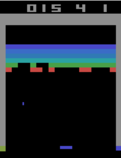

# Reinforcement Learning Breakout Atari
Reinforcement Learning Project for playing an Atari game called Breakout

A2C algorithm is used for this project. 
There are two saved models in this repository. One with 100k timesteps and one with 3M timesteps. These both can be compared, but more the timesteps, the better will be the model. 

100K Timesteps Learning gave a reward mean of 16.96 and a standard deviation of 4.591121867256412. 
3M Timesteps Learning gave a reward mean of 36.94 and a standard deviation of 10.718973831482192.

## Image with the Breakout Atari Game

    

## Try the game
You can also try the game in module 6 of the notebook
